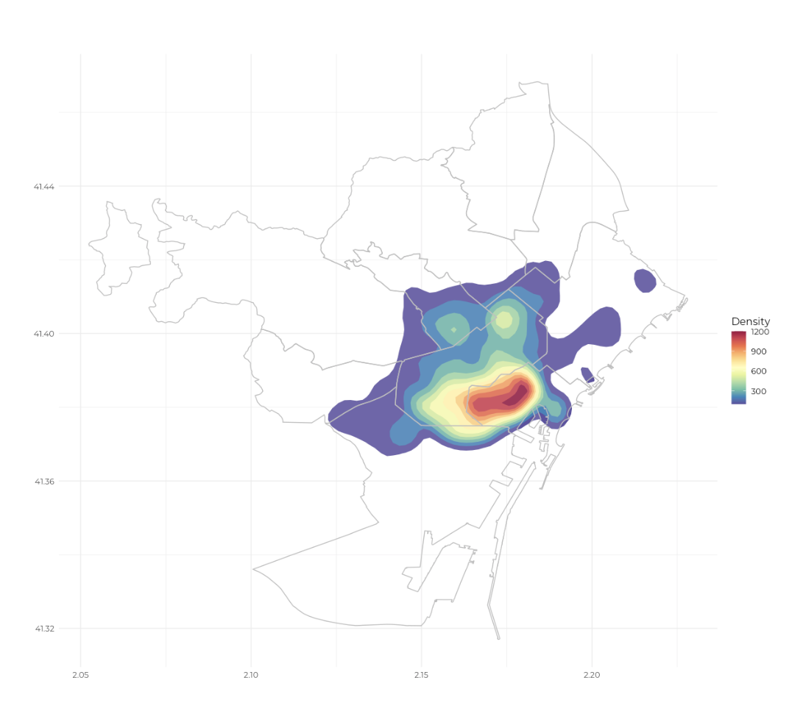
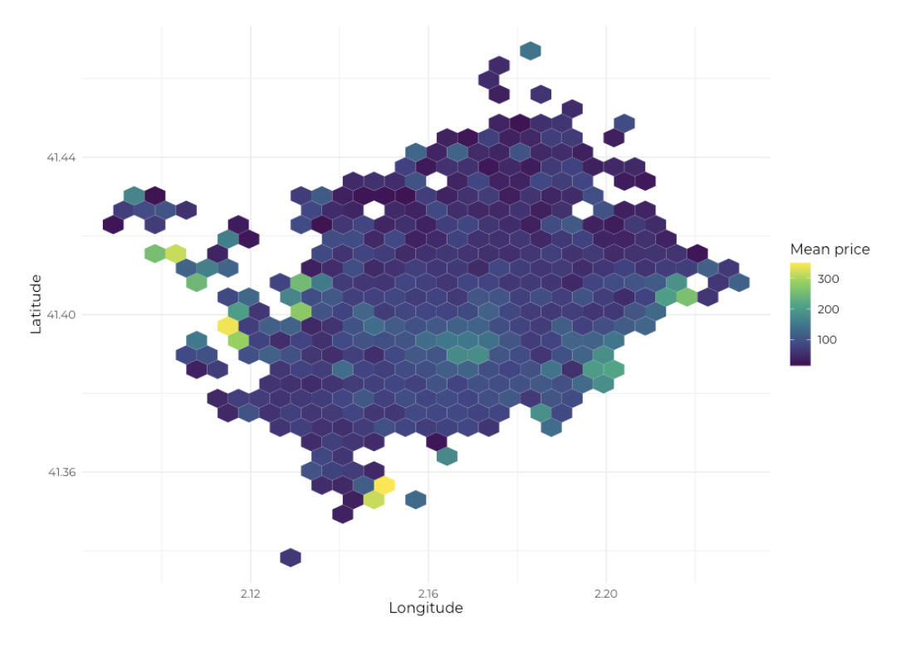
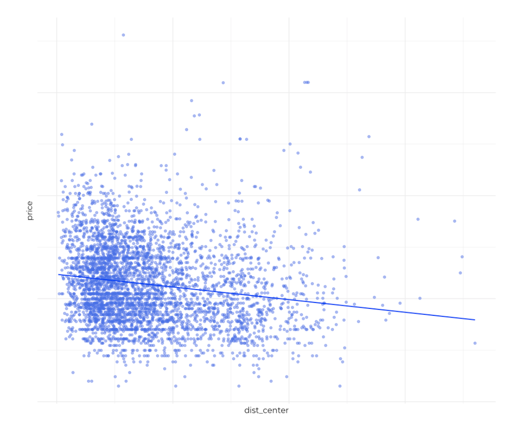
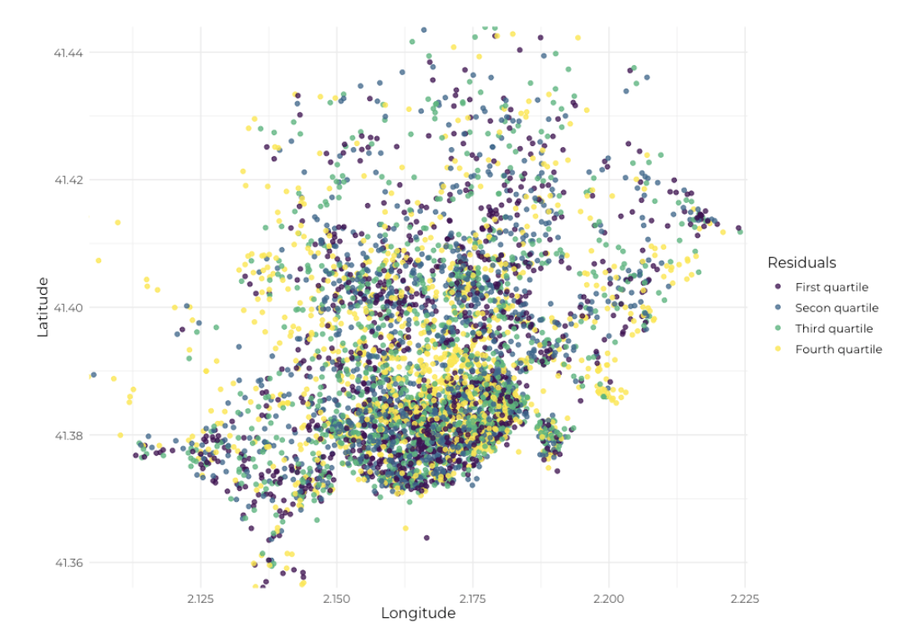
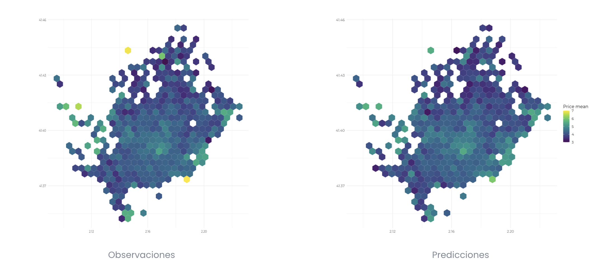
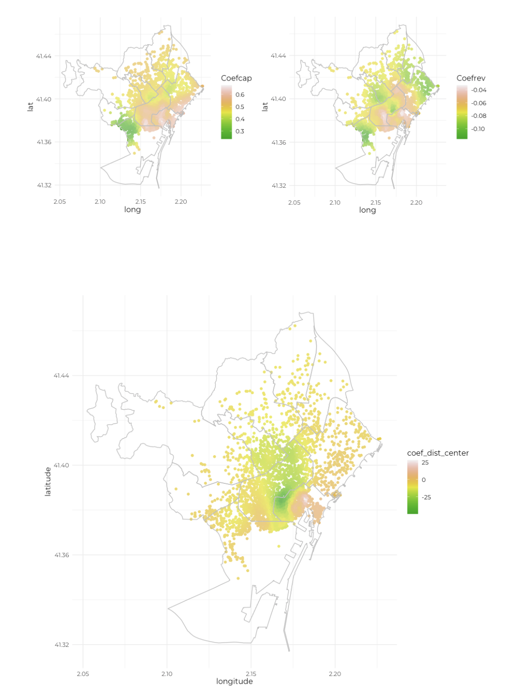

# Airbnb
*R, Geographical Regression*

 
La finalidad del proyecto es estudiar el impacto de la localización en el precio de los pisos ofertados en la plataforma Airbnb y algunos de sus predictores. Es decir, más allá de intentar determinar si los apartamentos céntricos presentan precios más elevados, se analiza cómo cambia la importancia de este y otros predictores, como la capacidad o el número de reseñas, para alojamientos en diferentes zonas de Barcelona. Esto se consigue gracias a la aplicación de un modelo de regresión ponderada geográficamente (GWR). 

## Objetivos 
- Estudiar la distribución de los alojamientos Airbnb en Barcelona
- Analizar el efecto de la localización en el precio y sus predictores
- Crear un modelo de predicción para el precio de los alojamientos

## Resultados 
- Los Airbnb se concentran en el centro y cerca del puerto
- La interacción entre precio y distancia varía espacialmente
- Modelo predictivo con un R2 casi global de 0.66

## Proyecto

### Mapa de densidad de los alojamientos

 
Como preámbulo, resulta interesante visualizar cómo se distribuye la oferta de Airbnb en Barcelona. Debido al elevado número de observaciones, se optó por un mapa de densidad.

Los alojamientos ofertados se concentran en los distritos de Ciutat Vella y Eixample, es decir, en las zonas céntricas y cercanas al paseo marítimo.

### Gráfico hexagonal del precio

 
Durante el análisis de los datos, los gráficos hexagonales permitieron analizar varias medidas estadísticas del precio con relación a la localización. Por su simplicidad y claridad resultan herramientas formidables para estudiar datos geográficos.

En este caso, puede intuirse la silueta de Barcelona, donde cada hexágono agrupa alojamientos cercanos. El color indica el precio medio para cada conjunto y revela zonas con precios significativamente más elevados en el frente marítimo y cerca del centro, así como algunos picos en el distrito de Sarrià-Sant Gervasi.

### Precio y distancia respecto al centro

 
Para modelar los datos se seleccionaron 4000 observaciones de forma aleatoria y se realizaron las transformaciones adecuadas.

La correlación entre el precio y la distancia resultó ser moderada (-0.17), siendo este más elevado para los apartamentos céntricos. No obstante, el hecho de incluir Airbnbs de zonas muy dispares en la ciudad hace que el uso de un solo coeficiente pueda oscurecer información relevante.

### Gráfico de residuos

 
Para averiguar si este es el caso se partió de un modelo de regresión múltiple para predecir el precio a partir de la capacidad, el número de reseñas, el tipo de habitación (vivienda, habitación privada o habitación compartida) y la distancia respecto al centro de los alojamientos.

Una vez creado, se analizaron los residuos con respecto a su localización para comprobar su distribución. En el gráfico pueden observarse ciertos patrones geográficos con clústeres de residuos del mismo color en varios puntos de la ciudad. Esta evidencia sugiere la utilización de un modelo alternativo capaz de incorporar información espacial.

### Regresión geográfica (GWR)

 
Se optó por una regresión ponderada geográficamente, es decir, un modelo en el que los coeficientes de regresión son calculados para cada subconjunto de observaciones vecinas. Esta decisión supuso una mejora significativa respecto al modelo lineal inicial, elevando el R2 de 0.57 hasta 0.66.

 

En los gráficos superiores pueden compararse los datos observados con las predicciones del modelo. En este caso, la escala de colores refleja el valor del logaritmo del precio medio. Como puede comprobarse, aunque el modelo sobrestima el precio de varios puntos céntricos y no reproduce los picos observados, se ajusta bastante a la realidad. Por lo tanto, podremos usarlo para estimar el coste de los Airbnbs en Barcelona.

### Variación geográfica de los coeficientes

 
La utilidad del modelo creado no se limita a la predicción, sino que nos revela información de interés en cuanto a las tendencias de los precios de los alojamientos.

Los mapas elaborados permiten visualizar como cambia la influencia en el precio de la capacidad, el número de reseñas o la distancia respecto al centro en cada punto geográfico. Indagar en el por qué de estos patrones va más allá del propósito de este informe y por ello solo se presentarán los resultados obtenidos.

Puede observarse que la importancia de la capacidad y las reseñas a la hora de determinar el precio no varía significativamente en el espacio. No obstante, es de interés mencionar que el número de huéspedes que pueden alojarse en un apartamento tiende a incrementar el precio en menor grado en la zona de Sants, en Gràcia con l'Eixample, y por debajo de Sagrada Familia.

En cuanto a las reseñas, su número parece reducir el precio de la oferta, especialmente en Sant Martí y Sant Andreu, así como en Sants-Montjuïc y también en la zona de plaza Catalunya.

Finalmente, el coeficiente de la distancia resulta el de mayor interés, ya que toma valores muy diferenciados para las distintas zonas del mapa.

En plaza Catalunya y alrededores, una localización céntrica puede incrementar significativamente el precio de la oferta. En menor grado, este es también el caso en la Dreta de l'Eixample y en Vila de Gràcia. En cambio, en la Barceloneta y en el Gòtic el efecto de la distancia en el precio se invierte, siendo la lejanía respecto al centro lo que tiende a incrementar el precio. Entre estos dos extremos, se encuentran toda una serie de zonas en las que la interacción entre precio y distancia es poco significativa.

